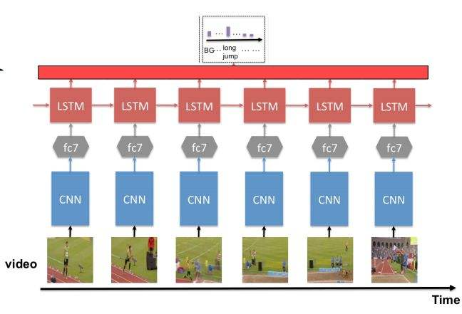

# Action Recognition

The network are based on CNNs and LSTMs.

[简体中文](docs/README-zh.md)

## Environment

Python 3.6.5 (Anaconda 5.2.0):

[https://mirrors.tuna.tsinghua.edu.cn/anaconda/archive/](https://mirrors.tuna.tsinghua.edu.cn/anaconda/archive/)

pytorch 0.4.1 (CUDA 9.0):

[https://pytorch.org/](https://pytorch.org/)

## Data

Use the following command to download the example data:

```
python data/download.py
```

Or download directly from [Google Drive](https://drive.google.com/file/d/1SI4mAeupeYQXbRN0zHqtfttULGHpXmw2/view?usp=sharing) and unzip.

The training dataset structure:

```
~/
  data/
    train_data/
      .../ (directories of class names)
        .../ (directories of video names)
          ... (jpg files)
    valid_data/
      .../ (directories of class names)
        .../ (directories of video names)
          ... (jpg files)
    save_model/
      save_100.pth
```

The test dataset structure:

```
~/
  test_data/
    .../ (directories of class names)
      .../ (directories of video names)
        ... (jpg files)
```

The data structure of the video training dataset:

```
~/
  video_data/
      .../ (directories of class names)
        ... (avi files)
```

Use `video2jpg.py` under the `utils` folder to convert avi to jpg:

```
python utils/video2jpg.py video_root_directory image_root_directory
```

Use `split_data.py` to move some of the training dataset to a validation dataset:

```
python utils/split_data.py train_root_directory valid_root_directory
```

## Train

Use the following command to train the model:

```
python train.py train_data_directory
```

For default:

```
python train.py data
```

Optional parameters of command:

```
--model DIR           path to model
--arch ARCH           model architecture (default: alexnet)
--lstm-layers LSTM    number of lstm layers (default: 1)
--hidden-size HIDDEN  output size of LSTM hidden layers (default: 512)
--fc-size FC_SIZE     size of fully connected layer before LSTM (default:
                      1024)
--epochs N            manual epoch number (default: 150)
--lr LR               initial learning rate (default: 0.01)
--optim OPTIM         optimizer (default: sgd)
--momentum M          momentum (default: 0.9)
--lr-step LR_STEP     learning rate decay frequency (default: 50)
--batch-size N        mini-batch size (default: 1)
--weight-decay W      weight decay (default: 1e-4)
--workers N           number of data loading workers (default: 8)
```

## Test

Use the following commands to test:

```
python test.py model_directory test_data_directory
```

For default:

```
python test.py data/save_model/model_best.pth.tar data/valid_data
```

## Predict

Use the following commands to predict:

```
python predict.py model_directory predict_data_directory
```

For default:

```
python test.py data/save_model/model_best.pth.tar data/predict_data
```

## Network

This project is based on CNNs and LSTMs. 

<div align="center">
  
</div>
